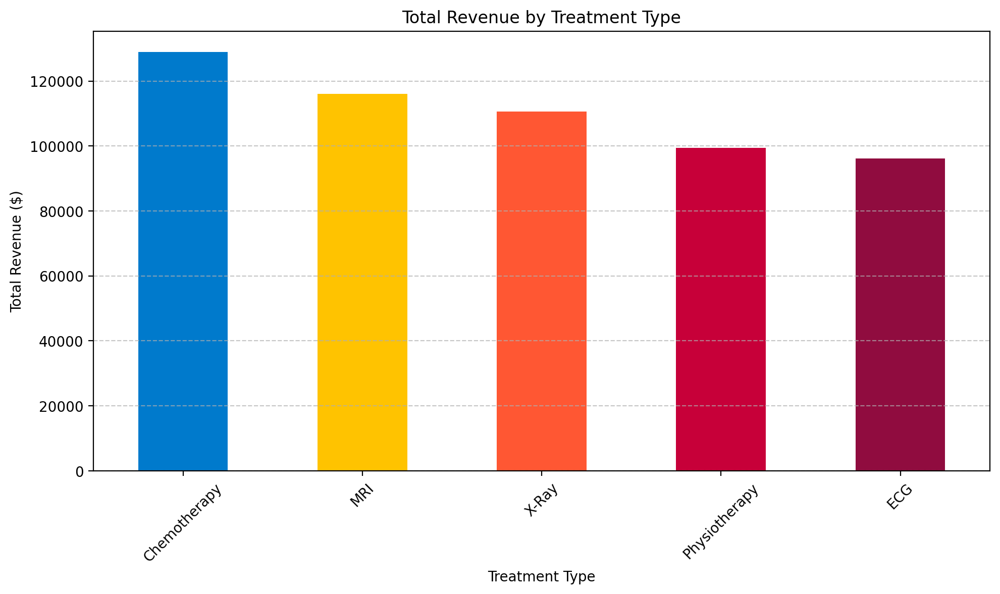
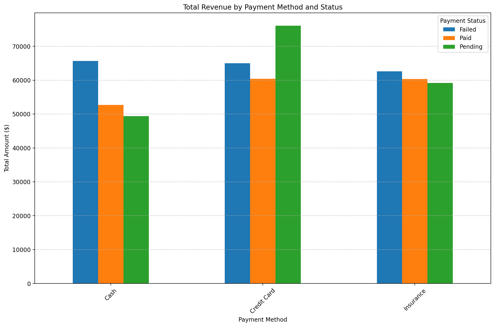
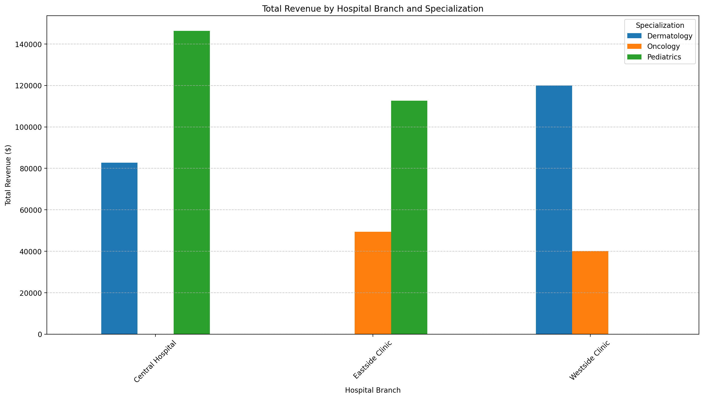

# Hospital-Management-Financial-Operational-Analysis

A hospital's leadership had five disconnected data sources: appointments, billing, doctor records, patient records, and treatments. No unified view of what was actually driving revenue, where cash flow was breaking down, or which branches and departments were performing best. I merged all five into a single dataset in Python, ran a full exploratory analysis, and used the findings to answer three questions: which services make the most money, how healthy is the billing pipeline, and which departments are worth replicating. The standout finding: **68.5% of total billed revenue, $377,825 out of $551,250, is currently sitting in Failed or Pending status**, meaning less than a third of everything the hospital has billed has actually been collected. That's a bigger problem than any single treatment or branch underperforming.

### The Business Problem

Hospital management needed a single, reliable answer to three operational questions: which treatments and departments generate the most revenue, how much of that revenue is actually being collected versus stuck in the billing pipeline, and which branches/specializations are performing well enough to model best practices from. Without a unified dataset, these questions couldn't be answered; the data lived in five separate systems (appointments, billing, doctors, patients, treatments) with no single source of truth.

### Data & Method

- **Tools:** Python (pandas, NumPy, Matplotlib, Seaborn) in Google Colab
- **Source:** 5 CSV files - `appointments.csv` (200 rows), `billing.csv` (200 rows), `doctors.csv` (10 rows), `patients.csv` (50 rows), `treatments.csv` (200 rows)
- **Cleaning:** converted `appointment_date`, `bill_date`, and `treatment_date` from object to datetime; ran a full data-quality check confirming 0 duplicate rows and no missing values across all 200 records
- **Merging:** joined `treatments` → `billing` (on `treatment_id`) → `appointments` (on `appointment_id`) → `doctors` (on `doctor_id`) into a single `hospital_master_df`, 25 columns × 200 rows
- **Data limitation worth flagging:** the `cost` (from treatments) and `amount` (from billing) columns are numerically identical across every row in this dataset - there's no variation from insurance adjustments, discounts, or partial payments. This is a known limitation of the synthetic dataset used for this exercise, not a finding about the hospital itself.

[Python Script](notebook/Hospital_Management_Notebook.ipynb)

### Key Insights

- **"Two-thirds of billed revenue - $377,825 of $551,250, is stuck in Failed or Pending status, not actually collected"**, only 31.5% of revenue billed has been successfully collected as Paid. This is the single most urgent finding in the dataset; it dwarfs any individual treatment or branch performance gap.
- **"Failed payments alone total $193,213 (35% of all billed revenue), spread fairly evenly across Cash, Credit Card, and Insurance"**, so because the failure isn't concentrated in one payment method, the root cause is more likely a systemic billing/processing issue than a problem specific to any one payment channel.
- **"Chemotherapy is the top-grossing treatment at $128,856, but this dataset doesn't show whether that's from higher per-treatment pricing or higher patient volume"**, a genuine limitation: the analysis has revenue totals by treatment type but not treatment counts by type, so the "why" behind Chemotherapy's lead can't be confirmed without a follow-up breakdown.
- **"Central Hospital's Pediatrics department leads in raw revenue ($146,343), but Westside Clinic's Oncology department earns the most per treatment ($3,090 avg vs. Central Pediatrics' $2,661)"**, raw revenue and revenue efficiency tell different stories; Oncology is the smallest department by volume but the most valuable per encounter.
- **"Monthly revenue and treatment volume move together, both peak in May, and both hit their lowest point in January but neither shows a sustained upward or downward trend across the 11-month window"**; this directly corrects an earlier read of this same data that described the trend as "consistent growth." The chart shows volatility, not growth: revenue swings between $28K and $64K month to month with no clear direction.

### Clear Recommendations

1. **Treat billing collection as the top priority, not a secondary concern.** With over two-thirds of revenue uncollected, this outweighs any treatment-mix or department-level decision in terms of financial impact.
2. **Investigate failed payments by root cause, not just by method.** Since failures are spread across Cash, Credit Card, and Insurance roughly evenly, cross-referencing failed bills against appointment status (No-show vs. Cancelled vs. Completed) would help determine whether failures trace back to patients who never completed their visit.
3. **Study Westside Oncology's per-treatment revenue model** and evaluate whether pricing, service mix, or patient profile explains its lead - then assess whether it's replicable in Eastside's Oncology department, which earns notably less per treatment.
4. **Don't act on the monthly trend as if it's a growth story.** With only 11 months of volatile data, more historical data is needed before concluding the hospital is on any particular trajectory.
5. **Add treatment-count data to the revenue-by-treatment-type analysis** to determine whether Chemotherapy's revenue lead is driven by volume or price - this changes whether the right response is a marketing push or a pricing review.

### About me

Hi, I'm **Alliyu Ajagun** known as **Alliyutheanalyst**.

I'm a Data Analyst with a background in Applied Mathematics and a passion for transforming raw data into actionable business insights using Excel, SQL, Python, and Power BI.

I enjoy solving business problems through data visualization, dashboard development, and analytical storytelling.

## Let's Connect
 
> Feel free to reach out: [ajagunalliyu@gmail.com](mailto:ajagunalliyu@gmail.com)  
> Connect with me on [LinkedIn](https://www.linkedin.com/in/alliyuajagun)  
> Follow on [Twitter/X](https://x.com/Sayyid_Alliyu)  
> Read more on [Medium](https://medium.com/@ajagunalliyu)  
> 💻 Explore more projects on [GitHub](https://github.com/ajagunalliyu)
> View [Portfolio website](https://sites.google.com/view/alliyutheanalyst/portfolio?authuser=0)

## ⭐ Support

If you found this project helpful or interesting, consider giving the repository a **star**. Your support helps increase the visibility of my work and encourages me to continue building and sharing data analytics projects.

Thank you for visiting!
